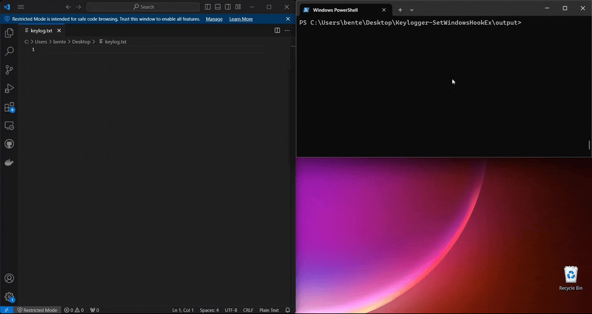

# Keylogger-SetWindowsHookEx

A key- and mouse logger that uses [Windows API hooks](https://learn.microsoft.com/en-us/windows/win32/winmsg/hooks) to capture the keystrokes and `SetWindowsHookEx` to install the procedures.

## Installer

The installer will start a new thread and use `SetWindowsHookEx` to install the hook procedures.
After that, it will start a message loop in that thread.
This is done because in case the procedure and the target application have a different architecture (x86 and x64).
In this case, the system executes the hook on the thread that called SetWindowsHookEx instead of in the target application.

## Procedures

All hooks are installed globally because we want to capture the input to every process running on the system.
Because of this, the procedures are located in a separate DLL.

Whenever a hook is triggered, the procedures will translate their function parameters to the actual keypress and log it to a file.

## Demo

1. Clone the repository:

    ```bash
    git clone https://github.com/BenteVE/Keylogger-SetWindowsHookEx.git
    ```

2. Build the installer executable and the procedures DLL in Visual Studio.

3. Run the installer

    ```cmd
    ./keylogger_installer_x64.exe ./keylogger_procedure_x64.dll --keyboard-ll --mouse-ll
    ```

4. Verify that the keylogger is working.
   All key and mouse presses should be logged to a file `keylog.txt` file on the desktop.

    
